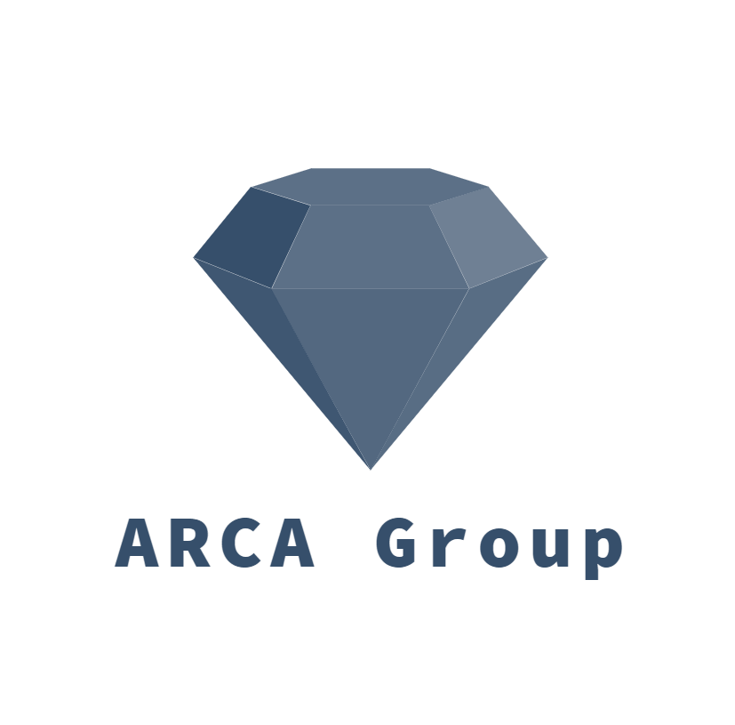
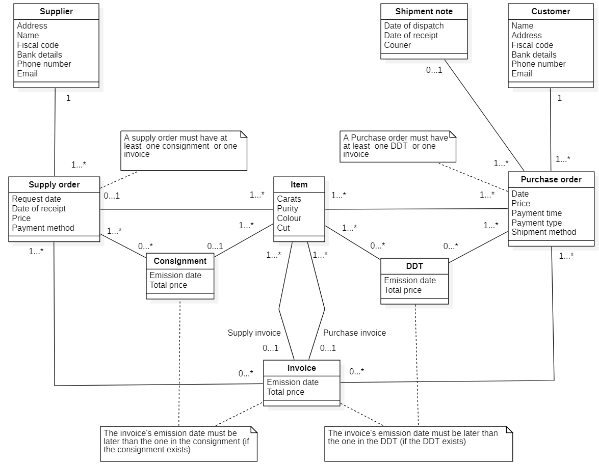

<h1>ARCA GROUP - AsIs</h1>

# Contents
- [Identification](#identification)
- [Finantial and legal information](#financial-and-legal-information)
- [Organizational variables](#organizational-variables)
    + [Size](#size)
    + [Products](#products)
    + [Goal type](#goal-type)
    + [Goal (vision mission)](#goal-vision-mission)
    + [Culture](#culture)
    + [Structure](#structure)
        * [IT Office](#it-office)
    + [Formalization, specialization and centralization](#formalization-specialization-and-centralization)
    + [Organizational type](#organizational-type)
- [Business model canvas](#business-model-canvas)
- [IS Views](#is-views)
    + [Functional view, data](#functional-view-data)
    + [Functional view, processes](#functional-view-processes)
        * [Sale](#sale)
        * [Purchase](#purchase)
    + [IT view](#it-view)
        * [Application portfolio](#application-portfolio)
        * [Technological view](#technological-view)
        * [Outsourcing](#outsourcing)
- [IT strategy](#it-strategy)
- [Indicators](#indicators)
    + [CSF](#csf)
    + [KPI](#kpi)
- [Summary analysis](#summary-analysis)    

Identification
==============

The company asked to remain anonymous.  
It deals with diamonds’ wholesale in a small city where jewellery is the main business sector.  
Name: ——————  
Partita IVA: ————  
  
Ateco CODE: 46.48.0

Financial and legal information
===============================

Turnover of year 2018: 1.3 M€.  
The fiscal form is sole trader (*Ditta individuale*).

Organizational variables
========================

Size
----

3 workers, including the owner.

Products
--------

Diamonds’ trade to manufacturing jewels company.

Goal type
---------

Utilitarian.

Goal (vision mission)
---------------------

Providing the highest quality diamonds available on the market at a
competitive price.

Culture
-------

Familiar activity founded in the 60s by the owner’s father, which
operates in a small town with lots of many familiar activities working
on their products.

Structure
---------

 As it can be seen from the
chart, the company reflects mostly a functional organization. In
addition there are no geographic divisions and different type of
products.

### IT Office

No IT office is present in the activity.  
IT services are delivered by external providers.  
Occasionally a consultant helps solving small issues.  
The annual IT expenses are around 1 K (0.08 % of the turnover).

Formalization, specialization and centralization
------------------------------------------------

The company has a very low level of formalization, since the size of the
company is small and there are few and simple processes. However, the
processes are constant and stable through the year, even though they
have not been formalized.  
The presence of a single type of product and a single class of customer
leads to a low specialization of the company.  
Because of the company’s size, all decisions are taken by the owner, and
so the centralization is high.

Organizational type
-------------------

Although the absence of formalization as explained before, the company
can be classified as mechanical, due to the high centralization and the
stable environment.  
It may be considered as entrepreneurial, basing on its size and the low
formalization level.

Business Model Canvas
=====================

IS Views
========

Functional view, data
---------------------

*DDT* stands for *Documento di Trasporto* which substitutes the invoice in the shipment when the goods are sent in vision to the customer.

Functional view, processes
--------------------------

<table>
<thead>
<tr class="header">
<th style="text-align: left;">Process Name</th>
<th style="text-align: left;">Description</th>
<th style="text-align: left;">Input</th>
<th style="text-align: left;">Output</th>
</tr>
</thead>
<tbody>
<tr class="odd">
<td style="text-align: left;">Sale</td>
<td style="text-align: left;">Provide diamonds to the customer</td>
<td style="text-align: left;">Order request</td>
<td style="text-align: left;">Invoice + delivered item</td>
</tr>
<tr class="even">
<td style="text-align: left;">Purchase (subprocess of Sale)</td>
<td style="text-align: left;">Buy the needed diamonds from suppliers and on the market</td>
<td style="text-align: left;">Need in the stock</td>
<td style="text-align: left;">Diamonds in the stock</td>
</tr>
<tr class="odd">
<td style="text-align: left;">Evaluation</td>
<td style="text-align: left;">Evaluate diamond</td>
<td style="text-align: left;">Request from a customer</td>
<td style="text-align: left;">Evaluation document with gem characteristics, provenance and authenticity certificate</td>
</tr>
<tr class="even">
<td style="text-align: left;">Fixing</td>
<td style="text-align: left;">Fix broken or damaged jewels and cut diamonds</td>
<td style="text-align: left;">Request from a customer for an item to be repaired</td>
<td style="text-align: left;">Fixed item</td>
</tr>
</tbody>
</table>

### Sale

 

We detailed mostly the employee lane, since we have more access to the
process implementation and we think that is the most critical part.

### Purchase

IT view
-------

### Application portfolio

<table>
<thead>
<tr class="header">
<th style="text-align: center;">Application name</th>
<th style="text-align: center;">Vendor</th>
<th style="text-align: center;">Main functions</th>
</tr>
</thead>
<tbody>
<tr class="odd">
<td style="text-align: center;">Excel</td>
<td style="text-align: center;">Microsoft</td>
<td style="text-align: center;">Accounting and sales management</td>
</tr>
<tr class="even">
<td style="text-align: center;">Outlook</td>
<td style="text-align: center;">Microsoft</td>
<td style="text-align: center;">Mail client</td>
</tr>
<tr class="odd">
<td style="text-align: center;">Foxit Reader</td>
<td style="text-align: center;">Foxit</td>
<td style="text-align: center;">PDF reader</td>
</tr>
<tr class="even">
<td style="text-align: center;">Word</td>
<td style="text-align: center;">Microsoft</td>
<td style="text-align: center;">Create notes and documents</td>
</tr>
<tr class="odd">
<td style="text-align: center;">Esatto 2000</td>
<td style="text-align: center;">ESA software</td>
<td style="text-align: center;">Invoices creation and virtual warehouse management</td>
</tr>
<tr class="even">
<td style="text-align: center;">WebDesk-Fattura Smart</td>
<td style="text-align: center;">Wolters Kluwer</td>
<td style="text-align: center;">Electronic invoice web application</td>
</tr>
<tr class="odd">
<td style="text-align: center;">Brother</td>
<td style="text-align: center;">Brother</td>
<td style="text-align: center;">Scanner tool</td>
</tr>
<tr class="even">
<td style="text-align: center;">Scadenziario</td>
<td style="text-align: center;">External consultant development</td>
<td style="text-align: center;">Management of payments’ deadlines</td>
</tr>
</tbody>
</table>

### Technological view

  
Until some years ago the legacy PC was used for all the accounting.
Since it needed a replacement, some new equipments were bought. The
software to emit invoices, doesn’t run on the operating systems of the
new PC, so the old one keeps running this software, without any internet
connection.

### Outsourcing

As mentioned before, there is no IT office in the organization, so every IT service needs to be outsourced.  

Here there are the main services delivered by different companies:

-   Two companies hosting two different websites. One of them also provides the mail server.

-   An IT vendor giving also assistance to hardware issues.

-   A company providing the web application for electronic invoice  (*fatturazione elettronica*).

IT strategy
===========

The company has no specific IT strategy. IT is merely a tool that can be
used to reach a goal. So they have no interest in improving them until
something stops working properly.

Indicators
==========

CSF
---

These indicators have been directly provided by the company itself.

-   CSF1 Goods quality

-   CSF2 Competitive price

-   CSF3 Reputation over the years

-   CSF4 Being correct in negotiations

KPI
---

<table>
<thead>
<tr class="header">
<th style="text-align: left;">General KPIs</th>
<th style="text-align: left;">Sale and Purchase</th>
<th style="text-align: left;">CSF</th>
</tr>
</thead>
<tbody>
<tr class="odd">
<td style="text-align: left;">Input volume (number of orders per month)</td>
<td style="text-align: left;">Variable</td>
<td style="text-align: left;"></td>
</tr>
<tr class="even">
<td style="text-align: left;">Output volume (number of carats purchased/delivered)</td>
<td style="text-align: left;">Variable (10-100 ct)</td>
<td style="text-align: left;">CSF3</td>
</tr>
<tr class="odd">
<td style="text-align: left;">Human resources (number)</td>
<td style="text-align: left;">All three members</td>
<td style="text-align: left;"></td>
</tr>
<tr class="even">
<td style="text-align: left;">Inventory (avg unit stored)</td>
<td style="text-align: left;">Variable (150-300 ct)</td>
<td style="text-align: left;"></td>
</tr>
</tbody>
</table>

  

<table>
<thead>
<tr class="header">
<th style="text-align: left;">Efficiency KPIs</th>
<th style="text-align: left;">Sale and Purchase</th>
<th style="text-align: left;">CSF</th>
</tr>
</thead>
<tbody>
<tr class="odd">
<td style="text-align: left;">Money expense (per month)</td>
<td style="text-align: left;">3k-40k</td>
<td style="text-align: left;">CSF1, CSF2</td>
</tr>
<tr class="even">
<td style="text-align: left;">Money income (per month)</td>
<td style="text-align: left;">15k-190k</td>
<td style="text-align: left;"></td>
</tr>
<tr class="odd">
<td style="text-align: left;">Utilization of resources (hours worked on a day/ 8 hours)</td>
<td style="text-align: left;">60 %</td>
<td style="text-align: left;"></td>
</tr>
</tbody>
</table>

  

<table>
<thead>
<tr class="header">
<th style="text-align: left;">Quality KPIs</th>
<th style="text-align: left;">Sale and Purchase</th>
<th style="text-align: left;">CSF</th>
</tr>
</thead>
<tbody>
<tr class="odd">
<td style="text-align: left;">Conformity (% of correct orders)</td>
<td style="text-align: left;">90 %</td>
<td style="text-align: left;">CSF3</td>
</tr>
<tr class="even">
<td style="text-align: left;">Customer satisfaction</td>
<td style="text-align: left;">80-90 %</td>
<td style="text-align: left;">CSF3, CSF4</td>
</tr>
</tbody>
</table>

  

<table>
<thead>
<tr class="header">
<th style="text-align: left;">Service KPIs</th>
<th style="text-align: left;">Sale and Purchase</th>
<th style="text-align: left;">CSF</th>
</tr>
</thead>
<tbody>
<tr class="odd">
<td style="text-align: left;">Response time, Lead time (work day per order)</td>
<td style="text-align: left;">3-5 days (1-2 to process the order, 1-2 for purchase delivery, 0-1 for sale delivery)</td>
<td style="text-align: left;">CSF3</td>
</tr>
<tr class="even">
<td style="text-align: left;">On time orders (%)</td>
<td style="text-align: left;">70-80 %</td>
<td style="text-align: left;">CSF3, CSF4</td>
</tr>
<tr class="odd">
<td style="text-align: left;">Flexibility toward customers (% of modified orders)</td>
<td style="text-align: left;">10 %</td>
<td style="text-align: left;">CSF3</td>
</tr>
<tr class="even">
<td style="text-align: left;">Recurrent orders (% of orders that recurs every fixed interval of time )</td>
<td style="text-align: left;">50 %</td>
<td style="text-align: left;">CSF1, CSF2</td>
</tr>
</tbody>
</table>

  
Monthly number of order, income and expense can largely vary in base of
fair and exhibitions. Clients that participate to these events usually
buy a large amount of diamonds in the previous months.

Summary analysis
================

The main critical points detected in the analysis:

1.  use of legacy softwares and lack of integration between them (ex: print and scan invoices to import on *WebDesk*);

2.  use of replicated and not updated web sites;

3.  not linear process in accounting part of sale;

4.  organizational functions are not so well defined.

Since there is no IT office, no alignment problems can be detected.
