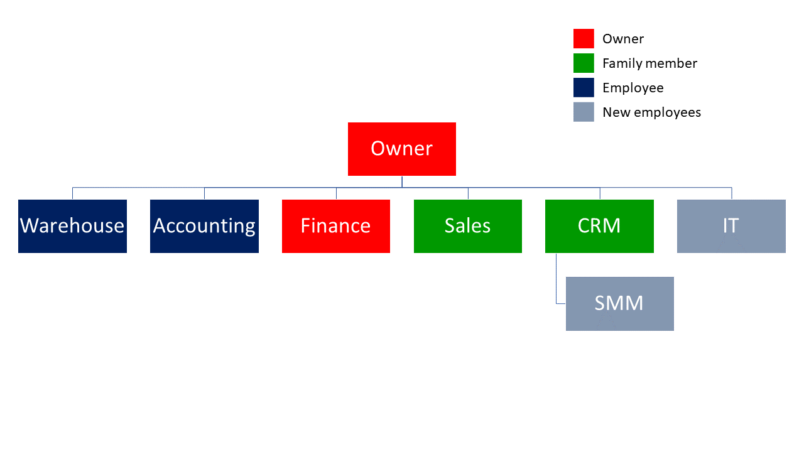
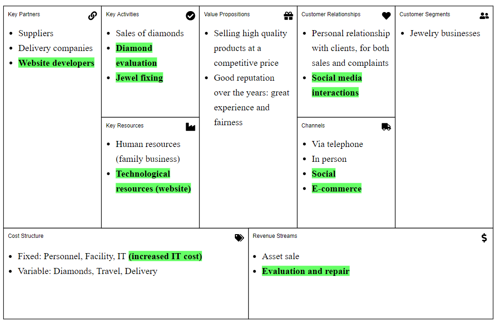
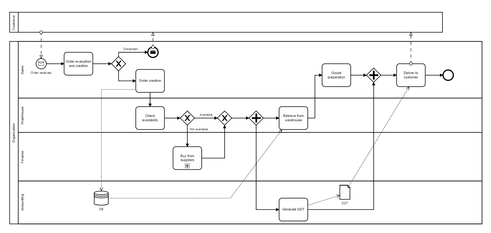
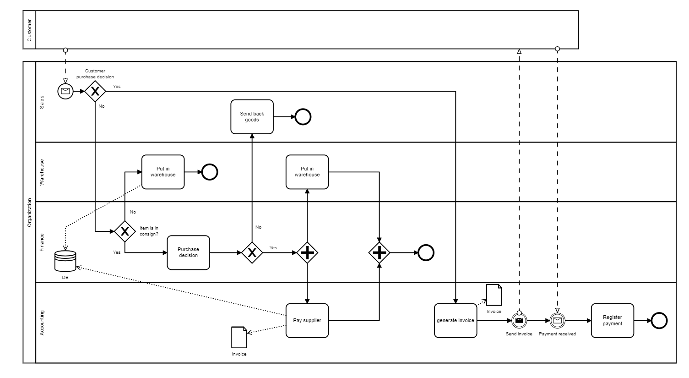
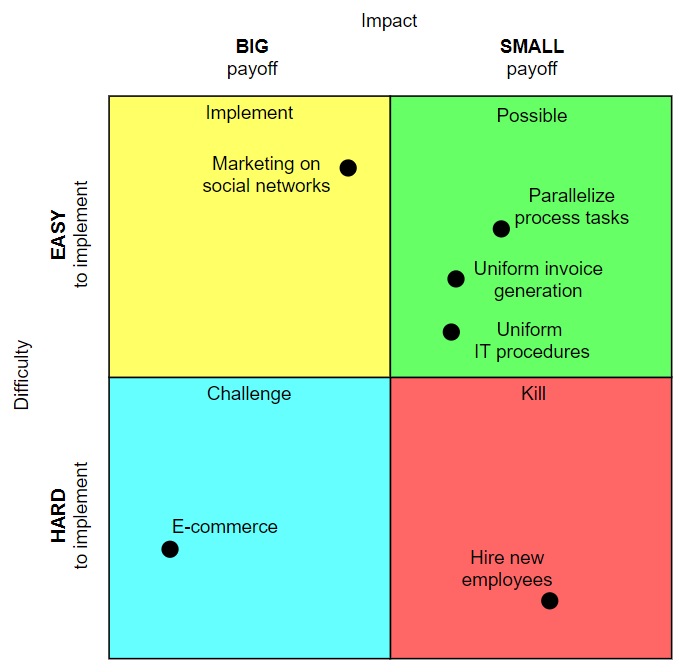
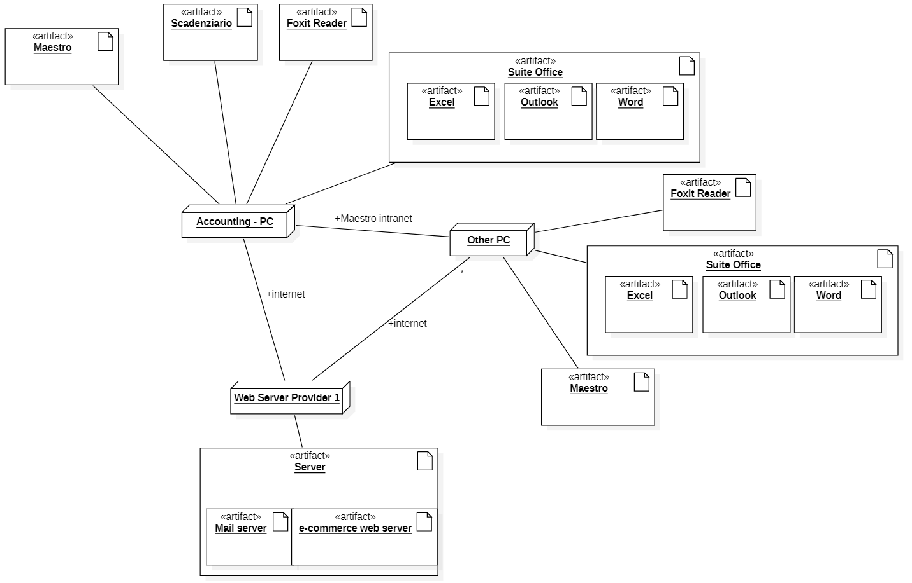

<h1>ARCA GROUP - ToBe</h1>

# Contents
- [Summary of changes](#summary-of-changes)
- [Organizational variables](#organizational-variables)
    + [Size](#size)
    + [Products/Services](#productsservices)
    + [Goal type](#goal-type)
    + [Goal (vision mission) and strategy](#goal-vision-mission-and-strategy)
    + [Culture](#culture)
    + [Structure](#structure)
        * [IT Office](#it-office)
    + [Formalization/Specialization/Centralization](#formalizationspecializationcentralization)
    + [Organizational type](#organizational-type)
- [Business model canvas](#business-model-canvas)
- [IS Views](#is-views)
    + [Functional view, data](#functional-view-data)
    + [Functional view, processes](#functional-view-processes)
        * [Order requested](#order-requested)
        * [Sale confirmation](#sale-confirmation)
        * [Process selection](#process-selection)
        * [Sale: software functions needed](#sale-software-functions-needed)
    + [IT view](#it-view)
        * [Application portfolio](#application-portfolio)
            - [ERP](#erp)
            - [E-commerce](#e-commerce)
        * [Technological view](#technological-view)
- [IT strategy](#it-strategy)
- [Effect of change(s)](#effect-of-changes)
    + [Effect on KPIs and CSFs](#effect-on-kpis-and-csfs)
    + [TCO, ROI and Break even](#tco-roi-and-break-even)
        * [Off-the-shelf E-commerce](#off-the-shelf-e-commerce)
        * [Custom E-commerce + IT person](#custom-e-commerce-it-person)
        * [Custom E-commerce](#custom-e-commerce)
    + [Risks](#risks)
- [Conclusion](#conclusion)      

# Summary of changes

Basing on the conclusions of AsIs analysis, we tried to solve those
critical points:

1.  adopt new software;

2.  one single web site with new e-commerce feature;

3.  redesign sale process;

4.  re-organize distribution of functions among employees.

In addition, we tried to analyse the effects of some improvements, such
as an addition of a Social Media Manager and an IT specialist.

Organizational variables
========================

Size
----

New employees for Social Media Management and IT could be hired.

Products/Services
-----------------

Add e-commerce platform.

Goal type
---------

No change.

Goal (vision mission) and strategy
----------------------------------

No change.

Culture
-------

No change.

Structure
---------

  
The idea is to better divide functions over members.

### IT Office

An IT Office could be needed to manage the e-commerce. Another option
are periodic outsourced consultancy but the know how on product
selection is missing.

Formalization/Specialization/Centralization
-------------------------------------------

No change.

Organizational type
-------------------

No change.

Business model canvas
=====================

Changes from AS IS has been highlighted in green.

IS Views
========

Functional view, data
---------------------

No change.

Functional view, processes
--------------------------

### Order requested

### Sale confirmation

### Process selection

### Sale: software functions needed

<table>
<thead>
<tr class="header">
<th style="text-align: center;">Activity in BPMN</th>
<th style="text-align: left;">Supporting software function</th>
</tr>
</thead>
<tbody>
<tr class="odd">
<td style="text-align: center;">Order creation</td>
<td style="text-align: left;">Insert order</td>
</tr>
<tr class="even">
<td style="text-align: center;">Check availability</td>
<td style="text-align: left;">Verify if item is in the warehouse</td>
</tr>
<tr class="odd">
<td style="text-align: center;">Buy</td>
<td style="text-align: left;">Insert item in warehouse and attached documents</td>
</tr>
<tr class="even">
<td style="text-align: center;">Retrieve</td>
<td style="text-align: left;">Remove item from warehouse</td>
</tr>
<tr class="odd">
<td style="text-align: center;">Generate DDT</td>
<td style="text-align: left;">Automatic creation of DDT</td>
</tr>
<tr class="even">
<td style="text-align: center;">Generate Invoice</td>
<td style="text-align: left;">Automatic creation of INVOICE + electronic invoice</td>
</tr>
<tr class="odd">
<td style="text-align: center;">Put in warehouse</td>
<td style="text-align: left;">Undo remove of item</td>
</tr>
<tr class="even">
<td style="text-align: center;">Pay supplier</td>
<td style="text-align: left;">Change description of item in warehouse(consignment to purchased)</td>
</tr>
<tr class="odd">
<td style="text-align: center;">Register payment</td>
<td style="text-align: left;">Register payment</td>
</tr>
</tbody>
</table>

IT view
-------

### Application portfolio

The solution proposed is made of two main blocks:

-   a unique information system that integrates all the functions
    needed. The product that reveals to best fit the requirements is
    *Maestro* (see later for product description).

-   an e-commerce platform that replaces the old 2 sites. The
    implementation of this part was already in the plan of the company
    and fits with our CRM vision, so we tried to estimate costs of this
    choice.

Consequently, *Esatto 2000* and *WebDesk - Fattura Smart* will be surely
abandoned. In addition, the 2 domains will be replaced by a single one
that includes the e-commerce platform: we don’t look for the best
solution for that, since the analysis of the requirements of this part
is huge. 
We choose to keep these two parts as independent parts, since we think that:

-   it is better not to buy all together from the same vendor

-   separate tools allows to drop the e-commerce tool if comes up not to fit the company

-   by knowing the company, it's better to introduce changes step by step

#### Selection

##### ERP  
All selected products have only a fixed cost and no periodic fees.

<table>
<thead>
<tr class="header">
<th style="text-align: center;">Application Name</th>
<th style="text-align: center;">Vendor</th>
<th style="text-align: left;">Description</th>
<th style="text-align: center;">Price model</th>
</tr>
</thead>
<tbody>
<tr class="odd">
<td style="text-align: center;">Impresa Plus</td>
<td style="text-align: center;">Gestionale amica</td>
<td style="text-align: left;">Modular application for warehouse management and order management</td>
<td style="text-align: center;">426 €</td>
</tr>
<tr class="even">
<td style="text-align: center;">Maestro</td>
<td style="text-align: center;">Geniosoft</td>
<td style="text-align: left;">Application for warehouse management, order management and accounting</td>
<td style="text-align: center;">182 €  GOLD version</td>
</tr>
<tr class="odd">
<td style="text-align: center;">OFBiz</td>
<td style="text-align: center;">Apache</td>
<td style="text-align: left;">Fully customizable ERP</td>
<td style="text-align: center;">free</td>
</tr>
</tbody>
</table>

<table>
<thead>
<tr class="header">
<th style="text-align: left;">Criterion (score 0-5)</th>
<th style="text-align: center;">Impresa Plus</th>
<th style="text-align: center;">Maestro</th>
<th style="text-align: center;">OFBiz</th>
</tr>
</thead>
<tbody>
<tr class="odd">
<td style="text-align: left;">Order management</td>
<td style="text-align: center;">5</td>
<td style="text-align: center;">4</td>
<td style="text-align: center;">5</td>
</tr>
<tr class="even">
<td style="text-align: left;">Invoices’ generation</td>
<td style="text-align: center;">4</td>
<td style="text-align: center;">5</td>
<td style="text-align: center;">1</td>
</tr>
<tr class="odd">
<td style="text-align: left;">DDT generation</td>
<td style="text-align: center;">3</td>
<td style="text-align: center;">5</td>
<td style="text-align: center;"></td>
</tr>
<tr class="even">
<td style="text-align: left;">Warehouse management</td>
<td style="text-align: center;">4</td>
<td style="text-align: center;">4</td>
<td style="text-align: center;">5</td>
</tr>
<tr class="odd">
<td style="text-align: left;">Electronic invoice</td>
<td style="text-align: center;">4</td>
<td style="text-align: center;">5</td>
<td style="text-align: center;"></td>
</tr>
<tr class="even">
<td style="text-align: left;">Accounting management</td>
<td style="text-align: center;"></td>
<td style="text-align: center;">3</td>
<td style="text-align: center;">4</td>
</tr>
<tr class="odd">
<td style="text-align: left;">Price</td>
<td style="text-align: center;">1</td>
<td style="text-align: center;">3</td>
<td style="text-align: center;">5</td>
</tr>
<tr class="even">
<td style="text-align: left;">User friendly</td>
<td style="text-align: center;">1</td>
<td style="text-align: center;">5</td>
<td style="text-align: center;">4</td>
</tr>
<tr class="odd">
<td style="text-align: left;">Unique system (no other application for similar activity survives)</td>
<td style="text-align: center;"></td>
<td style="text-align: center;">5</td>
<td style="text-align: center;"></td>
</tr>
<tr class="even">
<td style="text-align: left;">Ease of configuration</td>
<td style="text-align: center;">4</td>
<td style="text-align: center;">5</td>
<td style="text-align: center;">1</td>
</tr>
<tr class="odd">
<td style="text-align: left;">Vendor’s reputation</td>
<td style="text-align: center;">3</td>
<td style="text-align: center;">1</td>
<td style="text-align: center;">5</td>
</tr>
<tr class="even">
<td style="text-align: left;">E-commerce integration</td>
<td style="text-align: center;"></td>
<td style="text-align: center;">3</td>
<td style="text-align: center;">5</td>
</tr>
<tr class="odd">
<td style="text-align: left;"><strong>TOTAL:</strong></td>
<td style="text-align: center;"><strong>29</strong></td>
<td style="text-align: center;"><strong>48</strong></td>
<td style="text-align: center;"><strong>35</strong></td>
</tr>
</tbody>
</table>

##### E-commerce

By choosing *Maestro* as ERP, we choose to analyze e-commerce platform which are declared compatible with it:
- *Magento*, solution from Adobe. It is not possible to evaluate it with a demo (a written request has to be done). This solution is so discarded.
- *WooCommerce*, open-source solution based on *WordPress*. It is very modular, customizable. There is no clear information about commissions on payments in Europe. Basing U.S. ones, with evaluated it as 3-4%. Modules have a annual subscription, that can be estimated on 200-300 €/year, basing on the needed tools.
- *Prestashop*, open-source solution. It is very modular too, but offers more features in the base version (free). It seems to be more ready to use. Commissions are variable, depending on the payment system used. On average they can be considered as 2.5 - 3%.

Also a custom solution can be evaluated, providing the same APIs of the previous platforms.

It is not so easy to evaluate the effective cost, since it depends on the market that will pass through e-commerce and also new market segments. 

<table>
<thead>
<tr class="header">
<th style="text-align: left;">Criterion (score 0-5)</th>
<th style="text-align: center;">Prestashop</th>
<th style="text-align: center;">WooCommerce</th>
</tr>
</thead>
<tbody>
<tr class="odd">
<td style="text-align: left;">Price</td>
<td style="text-align: center;">3</td>
<td style="text-align: center;">2</td>
</tr>
<tr class="even">
<td style="text-align: left;">Usability</td>
<td style="text-align: center;">4</td>
<td style="text-align: center;">5</td>
</tr>
<tr class="odd">
<td style="text-align: left;">GUI - friendly</td>
<td style="text-align: center;">3</td>
<td style="text-align: center;">4</td>
</tr>
<tr class="even">
<td style="text-align: left;">Native portability</td>
<td style="text-align: center;">5</td>
<td style="text-align: center;">4</td>
</tr>
<tr class="odd">
<td style="text-align: left;">Multi-language support</td>
<td style="text-align: center;">5</td>
<td style="text-align: center;">3*</td>
</tr>
<tr class="even">
<td style="text-align: left;">Multi-currency</td>
<td style="text-align: center;">5</td>
<td style="text-align: center;">3*</td>
</tr>
<tr class="odd">
<td style="text-align: left;">Back-office UI</td>
<td style="text-align: center;">4</td>
<td style="text-align: center;">2</td>
</tr>
<tr class="even">
<td style="text-align: left;">Ready to use</td>
<td style="text-align: center;">5</td>
<td style="text-align: center;">3</td>
</tr>
<tr class="odd">
<td style="text-align: left;"><strong>TOTAL:</strong></td>
<td style="text-align: center;"><strong>34</strong></td>
<td style="text-align: center;"><strong>26</strong></td>
</tr>
</tbody>
</table>

*) The functionalities are provided by a module.

#### Coverage

  
Functions needed by the process are quite standard. Having a quick look
of the demo software, *Maestro*’s functions fit well the process and
reflects the structure of *Esatto 2000*. No gap is detected.

### Technological view

#### Integration

  
In the proposed solution there are no more old softwares running in
parallel with the new one, the integration between systems is not
present.  
The only integration to do is the migration of data. *Esatto 2000*
provides export functions. Cost of this transaction is included in the
deployment of TCO.

IT strategy
===========

Currently there is no IT know-how in the organization, so consultancy
(from a consulting company or an IT adviser) is needed to select
software products and a development team to build the e-commerce
website.  
Given the lack of a previous IT strategy, there is no transition to the
new one.

Effect of change(s)
===================

Effect on KPIs and CSFs
-----------------------

<table>

<tbody>
<thead>
<tr class="header">
<th style="text-align: center;">KPI</th>
<th style="text-align: center;">Effect</th>
<th style="text-align: center;">Variation</th>
</tr>
</thead>
<tr class="odd">
<td style="text-align: left;">I_V</td>
<td style="text-align: left;">New orders due to e-commerce</td>
<td style="text-align: left;">Increase, not estimable</td>
</tr>
<tr class="even">
<td style="text-align: left;">O_V</td>
<td style="text-align: left;">New sales due to e-commerce</td>
<td style="text-align: left;">Increase proportionally to I_V</td>
</tr>
<tr class="odd">
<td style="text-align: left;">M_E</td>
<td style="text-align: left;">Increase (e-commerce, new staff)</td>
<td style="text-align: left;">2k€\month  </td>
</tr>
<tr class="even">
<td style="text-align: left;">M_I</td>
<td style="text-align: left;">Increase thanks to e-commerce and SMM</td>
<td style="text-align: left;">Increase proportionally to I_V</td>
</tr>
<tr class="odd">
<td style="text-align: left;">U_R</td>
<td style="text-align: left;">Decrease per single order but overall increase due to the new orders</td>
<td style="text-align: left;">Increase, not estimable</td>
</tr>
<tr class="even">
<td style="text-align: left;">C_S </td>
<td style="text-align: left;">Better orders management and sales channels</td>
<td style="text-align: left;">Increase</td>
</tr>
<tr class="odd">
<td style="text-align: left;">R_T</td>
<td style="text-align: left;">Decrease due to automatization</td>
<td style="text-align: left;">about 1 day</td>
</tr>
<tr class="even">
<td style="text-align: left;">L_T</td>
<td style="text-align: left;">R_T is lower but delay may increase because of the amount of order to manage</td>
<td style="text-align: left;">Not estimable</td>
</tr>
<tr class="odd">
<td style="text-align: left;">OT_O</td>
<td style="text-align: left;">May decrease</td>
<td style="text-align: left;">Not estimable</td>
</tr>
</tbody>
</table>

<table>
<thead>
<tr class="header">
<th style="text-align: center;">CSF</th>
<th style="text-align: center;">Effect</th>
</tr>
</thead>
<tbody>
<tr class="odd">
<td style="text-align: left;">CSF2</td>
<td style="text-align: left;">Product price could be lowered if I_V and M_I increase</td>
</tr>
<tr class="even">
<td style="text-align: left;">CSF3</td>
<td style="text-align: left;">Increase reputation due to CRM (SMM) and new and faster sale channel.</td>
</tr>
</tbody>
</table>

TCO, ROI and Break even
-----------------------

We start considering that the SMM figure is a cost that may not have
directly benefits on incomes, basing on the PICK chart. This function
can be done by the familiar, who already performs CRM.

### Off-the-shelf E-commerce

The cost of e-commerce is estimated supposing that the income will have an increment of 15%. In that case the cost of *Prestashop* will be about 4800 €/year

-   Construction = 582€ (182€ management application, 400 € installation consulting)

-   Deployment = 600€ (200€ domain transfer, 200€ training and 200€ data transition)

-   Operation (per year) = 5000€ (200€ hosting, 4800 € commision on payments)

-   Saving (per year) = 880€ (160€ electronic invoice software, 360€ website domain and 360€ Esatto license)

<table>
<thead>
<tr class="header">
<th style="text-align: center;">Year</th>
<th style="text-align: center;">1</th>
<th style="text-align: center;">2</th>
<th style="text-align: center;">3</th>
<th style="text-align: center;">TOTAL</th>
</tr>
</thead>
<tbody>
<tr class="odd">
<td style="text-align: center;">Benefit</td>
<td style="text-align: center;">S = 880€ </td>
<td style="text-align: center;">S = 880€ </td>
<td style="text-align: center;">S = 880€ </td>
<td style="text-align: center;">2640€</td>
</tr>
<tr class="even">
<td style="text-align: center;">Cost</td>
<td style="text-align: center;">C+D+O = 6182€ </td>
<td style="text-align: center;">O = 5000€ </td>
<td style="text-align: center;">O = 5000€ </td>
<td style="text-align: center;">16182€</td>
</tr>
<tr class="odd">
<td style="text-align: center;">Benefit-cost</td>
<td style="text-align: center;"> − 5302€</td>
<td style="text-align: center;"> − 4120€</td>
<td style="text-align: center;"> − 4120€</td>
<td style="text-align: center;"> − 13542€</td>
</tr>
</tbody>
</table>

This value is dependent on the variation of the turnover that comes from the web site.

### Custom e-commerce + IT person

Another solution that we evaluate is the one that uses a custom development of the web site: we think that this solution can be more flexible for the needs of the niche market the company deals with. We address a solution based on one-time cost.

An addition of an IT person in the staff is also included.

-   Construction = 4182€ (4k€ e-commerce website and 182€ management
    application)

-   Deployment = 600€ (200€ domain transfer, 200€ training and 200€ data
    transition)

-   Operation (per year) = 20200€ (200€ hosting and 20k€ salary)

-   Saving (per year) = 880€ (160€ electronic invoice software,
    360€ website domain and 360€ Esatto license)

<table>
<thead>
<tr class="header">
<th style="text-align: center;">Year</th>
<th style="text-align: center;">1</th>
<th style="text-align: center;">2</th>
<th style="text-align: center;">3</th>
<th style="text-align: center;">TOTAL</th>
</tr>
</thead>
<tbody>
<tr class="odd">
<td style="text-align: center;">Benefit</td>
<td style="text-align: center;">S = 880€ </td>
<td style="text-align: center;">S = 880€ </td>
<td style="text-align: center;">S = 880€ </td>
<td style="text-align: center;">2640€</td>
</tr>
<tr class="even">
<td style="text-align: center;">Cost</td>
<td style="text-align: center;">C+D+O = 24982€ </td>
<td style="text-align: center;">O = 20200€ </td>
<td style="text-align: center;">O = 20200€ </td>
<td style="text-align: center;">65382€</td>
</tr>
<tr class="odd">
<td style="text-align: center;">Benefit-cost</td>
<td style="text-align: center;"> − 24102€</td>
<td style="text-align: center;"> − 43422€</td>
<td style="text-align: center;"> − 62742€</td>
<td style="text-align: center;"> − 62742€</td>
</tr>
</tbody>
</table>

### Custom e-commerce

Even taking into account the increased revenue from the e-commerce,
21k€ per year are a significant cost, so the idea of a permanent IT expert from the previous point
should be reconsidered, in favour of IT consultancy (personal or
agency) during the deployment period (estimated to be four months).  
In this case:

-   Construction = 4182€ (4k€ e-commerce website and 182€ management
    application)

-   Deployment = 7000€ (200€ domain transfer, 200€ training, 200€ data
    transition and 6400€ (1600€\*4 months) consultancy)

-   Operation (per year) = 200€ (hosting)

-   Saving (per year) = 880€ (160€ electronic invoice software,
    360€ website domain and 360€ Esatto license)

<table>
<thead>
<tr class="header">
<th style="text-align: center;">Year</th>
<th style="text-align: center;">1</th>
<th style="text-align: center;">2</th>
<th style="text-align: center;">3</th>
<th style="text-align: center;">TOTAL</th>
</tr>
</thead>
<tbody>
<tr class="odd">
<td style="text-align: center;">Benefit</td>
<td style="text-align: center;">S = 880€ </td>
<td style="text-align: center;">S = 880€ </td>
<td style="text-align: center;">S = 880€ </td>
<td style="text-align: center;">2640€</td>
</tr>
<tr class="even">
<td style="text-align: center;">Cost</td>
<td style="text-align: center;">C+D+O = 11382€ </td>
<td style="text-align: center;">O = 200€ </td>
<td style="text-align: center;">O = 200€ </td>
<td style="text-align: center;">11782€</td>
</tr>
<tr class="odd">
<td style="text-align: center;">Benefit-cost</td>
<td style="text-align: center;"> − 10502€</td>
<td style="text-align: center;"> − 9822€</td>
<td style="text-align: center;"> − 9142€</td>
<td style="text-align: center;"> − 9142€</td>
</tr>
</tbody>
</table>

In this situation there is a yearly expense of 3047€ considering a
three-year break-even. This sum is reasonably easy to reach and surpass,
even with a modest estimate of the additional revenues obtainable from
the introduction of the website.

Risks
-----

Basing on the current stable and static situation, any operation on the
process can be risky.  
Main risks are:

-   E-commerce platform not working as planned: corrective action could
    be taken if an IT person was present, otherwise it is not a huge
    cost and can be dismissed quite easily.

-   Process and new technologies could not fit the company: this is the
    biggest risk, but once employees are correctly trained, it would
    bring to a simpler and smarter process’ management.

Surely, every change should be introduced incrementally, in order not to
break the stability reached through years.

Conclusion
==========

Not all the planned ideas have proved to bring value to the company at a
manageable cost.  
Eventually, the changes proposed in the end seem to be feasible,
reasonably expensive, could improve the work environment and possibly
incomes.
